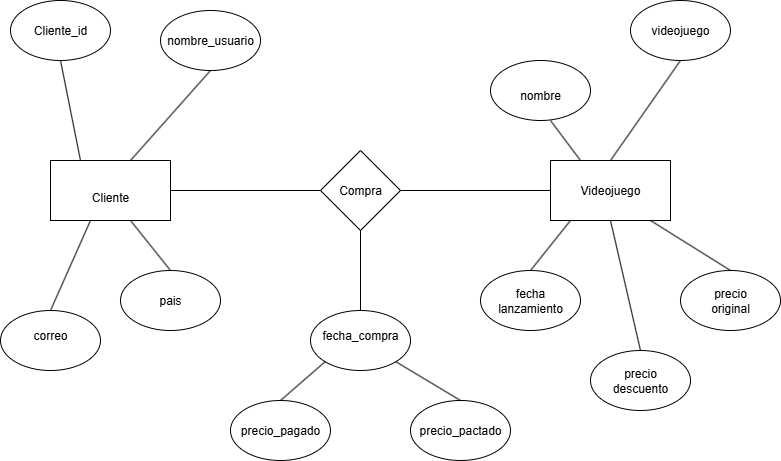

# Tarea 2 
 ## Modelo Entidad-Relacion

 Se realizo el modelo entidad-relacion en base a una base de datos sobre juegos en Steam.

 ## Dominio de los Atributos
 | Atributo            | Tipo de dato | Ejemplos de dominio                           |
| ------------------- | ------------ | --------------------------------------------- |
| `nombre`            | string       | "DOOM", "DayZ", "EVE Online"                  |
| `desarrollador`     | string       | "id Software", "Bohemia Interactive"          |
| `publisher`         | string       | "Bethesda Softworks", "CCP"                   |
| `fecha_lanzamiento` | date         | "May 12, 2016", "Dec 21, 2017"                |
| `genero`            | string       | "Action", "Adventure", "RPG", "Strategy"      |
| `precio_original`   | float/string | "\$19.99", "\$29.99", "Free"                  |
| `precio_descuento`  | float/string | "\$14.99", "\$59.97", vacío (sin descuento)   |
| `nombre_usuario`    | string       | "usuario1", "juan\_gamer", etc.               |
| `correo`            | string       | "[ejemplo@mail.com](mailto:ejemplo@mail.com)" |
| `pais`              | string       | "México", "USA", "Canadá", etc.               |
| `fecha_compra`      | date         | "2025-07-31", etc.                            |
| `precio_pagado`     | float        | 19.99, 14.99, etc.                            |

