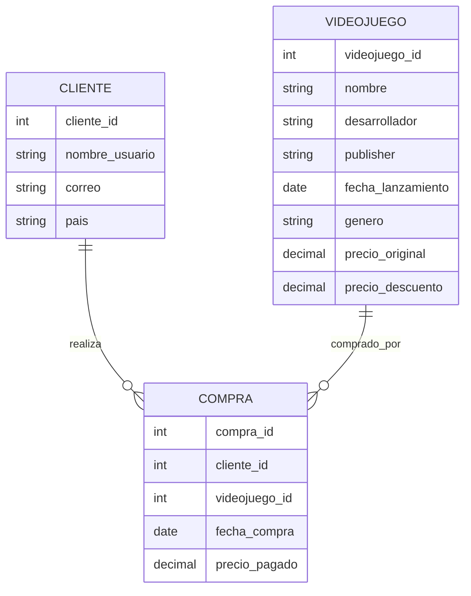

# Tarea 3
 ## Modelo Entidad-Relacion Videojuegos en Steam 

Se realizo el esquema del modelo relacional entidad-relación de la base de datos junto con los dominios de los atributos principales.

 ## Esquema Diagrama Relacional

- CLIENTE(cliente_id, nombre_usuario, correo, pais)
- VIDEOJUEGO(videojuego_id, nombre, desarrollador, publisher, fecha_lanzamiento, genero, precio_original, precio_descuento)
- COMPRA(compra_id, cliente_id, videojuego_id, fecha_compra, precio_pagado)

 ### Llaves
- cliente_id es PK en CLIENTE
- videojuego_id es PK en VIDEOJUEGO
- compra_id es PK en COMPRA
- cliente_id y videojuego_id en COMPRA son claves foráneas (FK) referenciando a CLIENTE y VIDEOJUEGO

 ## Operaciones con algebra relacional 
**1. Selección (σ)**

**Objetivo:** Obtener todos los videojuegos cuyo precio original sea mayor a $40.

**Álgebra relacional:** σ_precio_original > 40 (VIDEOJUEGO)

**Explicación:** Filtra la tabla de videojuegos y muestra solo aquellos que originalmente cuestan más de 40 dólares.

**2. Proyección (π)**

**Objetivo:** Mostrar solo los nombres y correos de los clientes

**Álgebra relacional:** π_nombre_usuario, correo (CLIENTE)

**Explicación:** Extrae únicamente las columnas de nombre de usuario y correo de la tabla CLIENTE, ignorando los demás atributos.

**3. Unión (∪)**

**Objetivo:** Unir dos listas de videojuegos con descuento y sin descuento

**Álgebra relacional:**
π_nombre (σ_precio_descuento IS NOT NULL (VIDEOJUEGO))
∪
π_nombre (σ_precio_descuento IS NULL (VIDEOJUEGO))

**Explicación:**
Junta en una sola lista todos los nombres de videojuegos, sin importar si tienen descuento o no.

**4. Join (⨝)**
**Objetivo:** Ver la información de cada compra junto con el nombre del cliente y del videojuego

**Álgebra relacional:** CLIENTE ⨝ COMPRA ⨝ VIDEOJUEGO

**Explicación:** Relaciona las tres tablas para ver, por ejemplo, qué cliente compró qué videojuego, en qué fecha y cuánto pagó.

